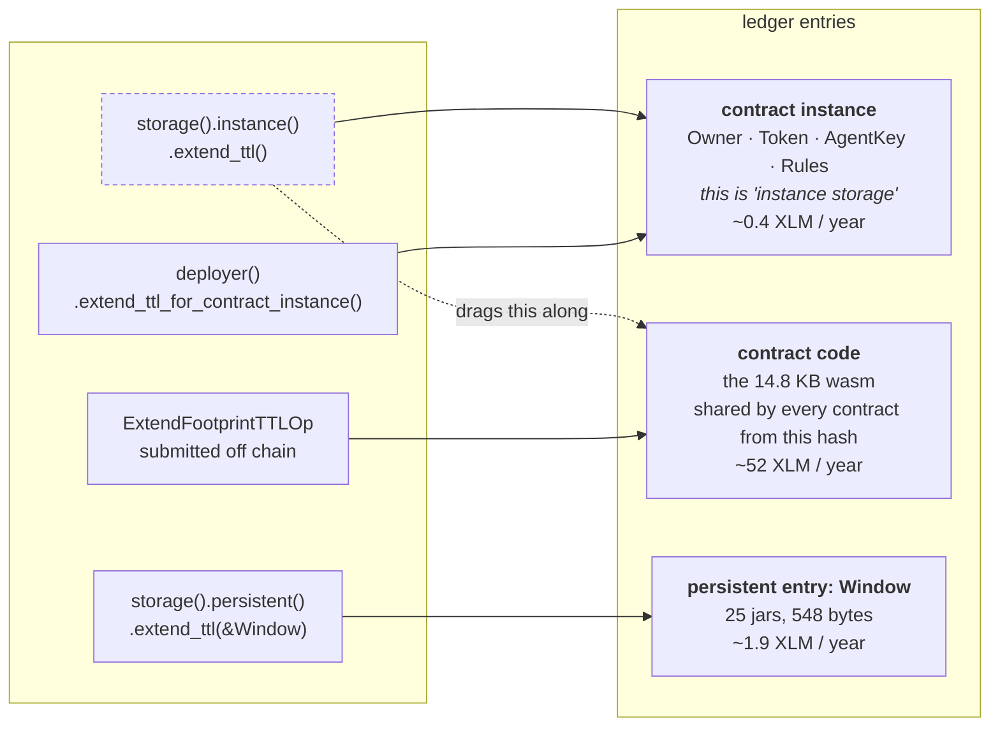

# Rent and revival

**Status:** current. Working notes for the unwritten `architecture.md`.

Every number here was measured against Stellar testnet on 2026-09-04, not read from
documentation. They are testnet settings and carry no mainnet claim. Two measurements are
still open, under Still to verify.

## The rule everything follows

Rent is charged on **ledgers added × entry size**. Nothing else moves a TTL:

- **using a contract does not extend anything** - a real successful invocation moved
  neither the instance clock nor the code clock
- **writing an entry does not extend it either**
- only an explicit `extend_ttl` from inside the contract, or an `ExtendFootprintTTLOp`
  from outside, adds time. The latter is **permissionless** - anyone may pay for anyone's
  entry

## Network settings (testnet, protocol 28)

| Setting | Ledgers | In time |
|---|---|---|
| `minPersistentTTL` - what a new entry is born with | 120,960 | 7 days |
| `maxEntryTTL` - the ceiling | 3,110,400 | 180 days |
| `minTemporaryTTL` | 720 | 1 hour |
| `persistentRentRateDenominator` | 1215 | - |
| `tempRentRateDenominator` | 2430 | temporary is exactly half price |

Derived marginal rate: **0.005558 stroops per byte per ledger**, from the code entry
(13,170 bytes at 73.2 stroops/ledger, where the fixed component is negligible).
That works out to roughly **0.0035 XLM per byte per year**.

## Wasm size is the rent lever, so measure it honestly

Every code-entry cost measured on chain here came from the **previously deployed**
allowance, whose wasm is 13,170 bytes. Rent scales linearly with entry size, so those are a
rate rather than a bill: read them as "per 13KB" and scale to whatever is actually shipping.

### Measure with the tool that builds the deployable artifact

The same source produces very different sizes depending on how it is built, and only one
of them is what goes on chain. Measured on CLI 27.1, same commit:

| pipeline | bytes |
|---|---|
| `cargo build --release --target wasm32v1-none` | 31,286 |
| `stellar contract build` | **14,793** |
| `stellar contract build --optimize` | 14,793 - identical |
| `stellar contract optimize` on that output | 14,793 - no change |

**`stellar contract build` already emits the optimized artifact.** `--optimize` changes
nothing, and the standalone `stellar contract optimize` is deprecated and a no-op here.

The trap is measuring - or shipping - a plain `cargo` build: it is **2.1× the size**, and
size is rent, for ever, on an entry nothing else pays for. Any size quoted anywhere should
say which command produced it.

### Where the rebuild stands

| | bytes | code rent / year |
|---|---|---|
| previously deployed allowance (the measured one) | 13,170 | ~46 XLM |
| rebuild at `aff81b8`, contract feature-complete | **14,793** | **~52 XLM** |

Measured per cycle, which is the only way to see what a decision actually costs:

| change | Δ bytes | Δ XLM / year |
|---|---|---|
| dropping XLM funding from the constructor | −1,259 | −4.41 |
| `spent_in_window` | +833 | +2.92 |
| `config` | +1,381 | +4.83 |

Two things worth taking from that. Removing the constructor's second `TokenClient` path and
the `AgentFunding` type paid for itself twice over. And a `#[contracttype]` in a *return*
position is not free even though it is never stored: most of `config`'s 1,381 bytes is
generated XDR conversion for its five fields.

## Who revives what

| Entry | Belongs to | Kept alive by | XLM / year | Times / year |
|---|---|---|---|---|
| **Factory instance** | **the project** | **a scheduled job** | ~0.4 | 2 |
| **Factory code** | **the project** | **a scheduled job** | ~46 per 13KB † | 2 |
| **Allowance code**, one per released version | **the project** | **a scheduled job** | ~52 (14,793 B) | 2 |
| **Splitter code**, one per released version | **the project** | **a scheduled job** | ~46 per 13KB † | 2 |
| Allowance instance | the owner | the payment path | ~0.4 | continuous |
| Window entry (25 slots, 548 B) | the owner | the payment path | ~1.9 | continuous |
| Splitter instance | the seller | `flush()` | ~0.4 | on each payout |
| Balance entries, per token per holder | nobody | the SAC, free | 0 | - |

† Neither is written yet. Their 13KB is a placeholder, not a measurement.

**Twice a year, not weekly.** Rent costs the same whether you add 180 days once or 7 days
twenty-six times - it is priced per ledger-byte, not per operation. Frequent extension
only adds base fees and more chances to forget. Extend toward the 180-day ceiling when the
remaining TTL has fallen far enough for the extension to be worth its base fee.


**Rough project total: ~147 XLM/year**, growing by **~52** for every allowance version kept
alive. That is the cost of the release scheme, and it is the reason migration prompts in
the web app are cost control rather than hygiene.

## Why the split falls where it does

An **instance** is small, so a payment can afford to top it up: 15,273 stroops for an
hour, 25,192 for a day, both inside the facilitator's 50,000 ceiling.

**Code is ~100× the size**, so its rent is ~100×: 155,916 stroops for a single hour,
three times the ceiling. No payment will ever carry it. That is what makes the wasm an
operational duty rather than a user cost - and it is shared, so one extension serves every
contract deployed from that hash.

## What lives where, and which call reaches it

The contract's own data is spread across three ledger entries, each on its own clock.



**"Instance storage" is not a separate entry.** Whatever goes in `storage().instance()`
lives *inside* the contract instance entry, so extending instance storage and extending the
contract instance are the same act. That is the part that reads as two things and is one.

The window is deliberately **not** in instance storage, even though that would mean one
entry, one clock and one read instead of two. An instance entry is written whole: changing
one jar rewrites the owner, the token, the agent key and the entire allowlist. The window
changes on every payment and the config changes almost never, so fusing them would rewrite
an unbounded, owner-controlled allowlist on every single payment - and write bytes are the
half of the resource fee the ceiling actually measures. Split what changes often from what
changes rarely. The price is the second clock in the diagram above.

### The trap

Two calls extend the code as well as the instance, and both are unusable on the payment
path: `env.deployer().extend_ttl()`, and - far more dangerous -
**`env.storage().instance().extend_ttl()`**, which is the call in nearly every Soroban
example. It reads as "extend my instance storage", it is documented under instance storage,
and it quietly takes a 14.8 KB wasm along with it. Every payment is then refused, with an
error that says nothing about TTL.

The only way to extend the instance alone is to reach through the deployer interface at your
own address:

```rust
env.deployer().extend_ttl_for_contract_instance(
    env.current_contract_address(), threshold, extend_to,
);
env.storage().persistent().extend_ttl(&DataKey::Window, threshold, extend_to);
```

Two entries, two calls. The code gets neither - see above.

## What lapsing costs

| Restoring | Stroops | vs the 50,000 ceiling |
|---|---|---|
| Contract instance | 57,133 | 1.14× over |
| Contract code | 4,274,783 | 85.5× over |
| Both | 4,320,225 | 86.4× over |

Measured against the 13,170-byte deployed version. Restore is priced per byte like rent, so
the rebuild's 14,793 bytes put a cold code restore nearer **4,800,000 stroops (~0.48 XLM)**.
Re-measure on deploy rather than trusting the scaling.

Protocol 23 restores archived entries *inside* the transaction that needs them, so there
is no `restorePreamble` to react to - the restore appears only as a fee that has grown
past what the facilitator accepts. A lapsed allowance therefore cannot revive itself in
the act of paying; the restore has to go out as its own transaction first.

Note the asymmetry: **restoring an instance costs more than a year of keeping it alive.**
The network charges very little for routine maintenance and a great deal for neglect.

## Window sizing

Each receipt in a per-payment list costs **72 bytes** (an `i128`, a `u32`, and the field
names, which are stored too). 24 buckets cost **548 bytes**, flat.

| Payments in window | List | 24 buckets |
|---|---|---|
| 1 | 152 B | 548 B |
| **7** | **break-even** | |
| 100 | 7,280 B | 548 B |
| 1000 | 72,080 B | 548 B |

At 200 receipts - the old `MAX_HISTORY` cap - the window entry is **14,480 bytes, larger
than the contract's own wasm**. Its own upkeep would exceed the fee ceiling, so a busy
agent's bookkeeping would price it out of paying, and `HistoryFull` fires far too late to
prevent it.

Chosen: **24 slices** - hourly on a daily window - held in **25 slots**.

The extra slot is not spare capacity, it is the fix for an off-by-one that runs the wrong
way. The slice being written to has barely elapsed, so with exactly 24 slots the remembered
span is 23-24 hours rather than 24: spending ages out *early* and the agent can move about
**4% over the cap**. With 25 slots the span is 24-25 hours, never shorter than the owner
asked for, so the agent is refused slightly early instead.

That is the rule the whole design follows: **when rounding, round toward refusing.** The
same instinct is behind `(window_ledgers / SLICES).max(1)`, which makes a window narrower
than the slice count come out wider than asked rather than dividing by zero.

`docs/rolling-window.md` works the arithmetic through with a five-jar example.

## Still to verify

- these are testnet settings; mainnet rent parameters must be re-measured before any
  mainnet claim
- the marginal byte-rate is derived from one large entry. A direct measurement on a small
  entry of known size would confirm there is no meaningful fixed component
